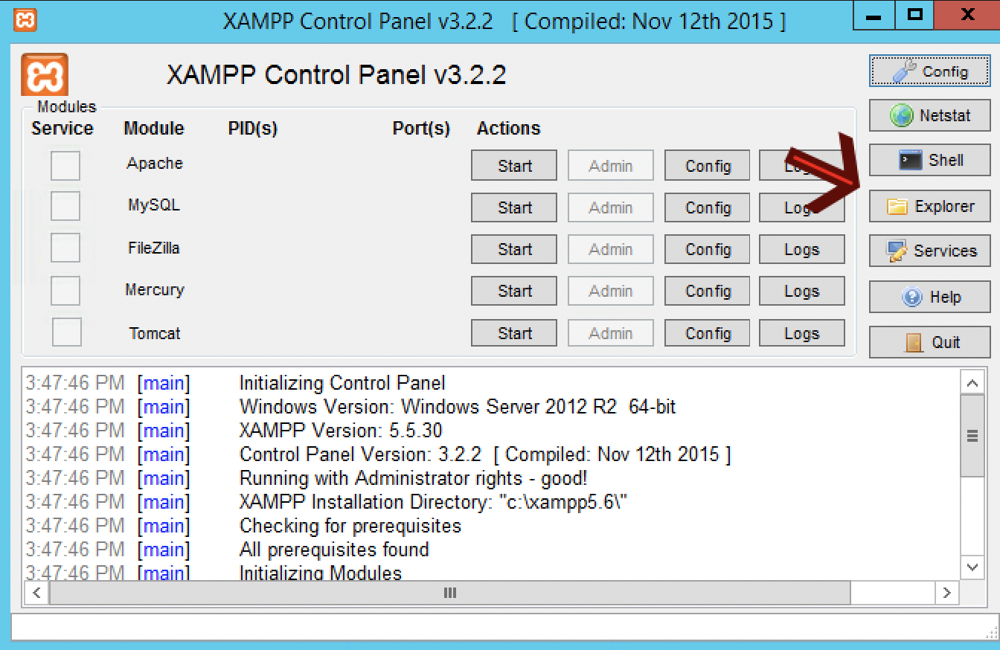

# project-1-basis-scrum-ruben-bram-joel-tim-semih
Welkom bij de readme van zoinks casino.
Hier word uitgelegd om de website te bekijken op een locahost.
Om te beginnen heb je xampp met apache nodig om een locahost op te zetten.

**Uitleg Windows :**

Download en installeer de laatste versie van [XAMPP](https://www.apachefriends.org/download.html) voor jouw operating system. 
Start de Apache module in het XAMPP controlcenter.

Ga in xampp naar het mapje explore zie afbeelding.
Open het mapje htdocs en plaats hier de map met de website er in

Ga in je browser naar http://localhost/ en kies voor het aangeleverde bestand.
Welkom op de website.

**Uitleg linux :**

Download en installeer de laatste versie van [XAMPP](https://www.apachefriends.org/download.html) voor jouw operating system. 
Start de Apache module in het XAMPP controlcenter.

Ga in xampp naar het mapje explore zie afbeelding.
Open het mapje htdocs en plaats hier de map met de website er in

Ga in je browser naar http://localhost/ en kies voor het aangeleverde bestand.
Welkom op de website.

**Uileg macOS :**

Download en installeer de laatste versie van [XAMPP](https://www.apachefriends.org/download.html) voor jouw operating system. 
Kiez voor de optie dat xampp direct op je pc gedownload word en NIET in een virtual machine.
Start de Apache module in het XAMPP controlcenter.

Ga in xampp naar het mapje explore zie afbeelding.
Open het mapje htdocs en plaats hier de map met de website er in

Ga in je browser naar http://localhost/ en kies voor het aangeleverde bestand.
Welkom op de website.